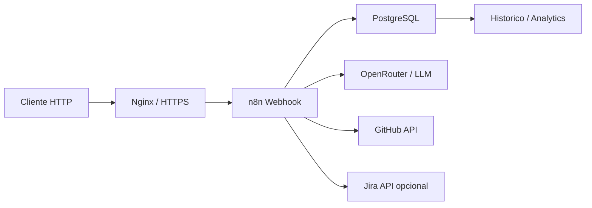
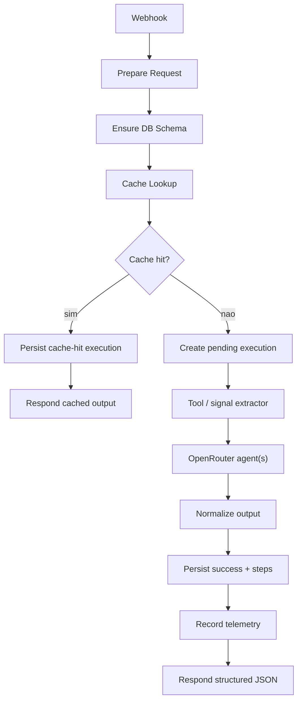

# Workflows e arquitetura

## Visao de arquitetura

O n8n e o orquestrador principal. Cada workflow recebe a chamada HTTP, valida payload, procura cache no PostgreSQL, executa tools deterministicas e/ou agentes, normaliza a resposta e persiste a execucao.

## Inventario

| Arquivo | Workflow | Endpoint | Papel |
|---------|----------|----------|-------|
| `health.json` | Health Check | `GET /webhook/health` | Verificacao simples de vida |
| `review.json` | Professional Code Review AI Agents | `POST /webhook/api/v1/review` | Review multi-agente de codigo |
| `pull-request-review.json` | Pull Request Review AI Agents | `POST /webhook/api/v1/review/pull-request` | Review de PR no GitHub com Jira opcional |
| `compliance.json` | Compliance AI Agent | `POST /webhook/api/v1/compliance` | Aderencia entre tarefa e codigo |
| `document.json` | Document AI Agent | `POST /webhook/api/v1/document` | Documentacao tecnica/operacional |
| `tests.json` | Tests AI Agent | `POST /webhook/api/v1/tests` | Geracao de testes por codigo |
| `pull-request-tests.json` | Pull Request Tests AI Agent | `POST /webhook/api/v1/tests/pull-request` | Geracao de testes baseada em PR |
| `batch.json` | Batch Flow Orchestrator | `POST /webhook/api/v1/batch` | Orquestracao sequencial de fluxos |
| `history-list.json` | History List API | `GET /webhook/api/v1/history` | Lista execucoes |
| `history-detail.json` | History Detail | `GET /webhook/api/v1/history/:id` | Detalhe de execucao |
| `analytics-usage.json` | Analytics Usage | `GET /webhook/api/v1/analytics/usage` | Agregacao de uso, tokens e custos |

## Fluxo padrao dos agentes

## Review de codigo

O `review.json` e o workflow mais completo. Ele roteia por linguagem (`typescript`, `javascript`, `python`, `php`), executa checks deterministicos simples e chama agentes especialistas:

- Naming Clarity Agent
- Error Handling Agent
- Resource Leak Agent
- Complexity Agent
- Security Agent
- Review Aggregator Agent

O agregador consolida achados repetidos e devolve o contrato publico:

- `overall_quality`
- `score`
- `issues`
- `positives`
- `summary`

## Compliance, documentacao e testes

Os workflows `compliance`, `document` e `tests` seguem o mesmo padrao:

- validam campos obrigatorios;
- aceitam `model` opcional, com fallback para `openai/gpt-4o-mini`;
- aceitam `prompt_version` positivo quando enviado;
- usam um node de extracao deterministica antes do agente;
- normalizam a saida para um JSON estavel;
- persistem execucao, steps e telemetria.

## Pull Requests

Os fluxos de PR usam GitHub API para buscar:

- metadados do PR;
- diff;
- arquivos alterados.

O review de PR pode consultar Jira quando o request enviar `jira_issue_key` e `jira_base_url`. Sem Jira, a secao correspondente e marcada como ignorada/skipped.

## Batch

O workflow `batch.json` recebe uma lista de itens e executa os fluxos individuais via HTTP interno:

- `review`
- `compliance`
- `document`
- `tests`

Ele aceita `continue_on_error`; quando `false`, a execucao para no primeiro erro. O resumo do batch e salvo em `batch_executions`.
